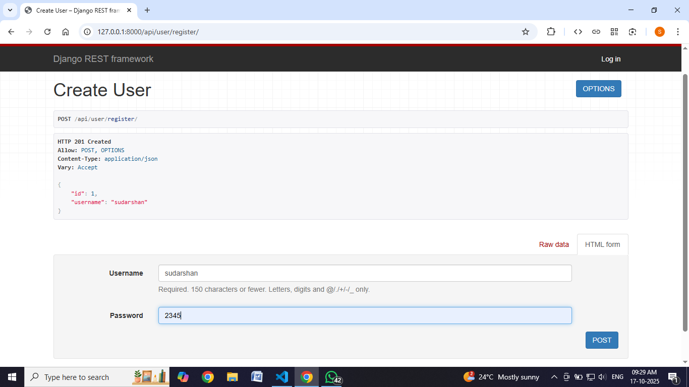
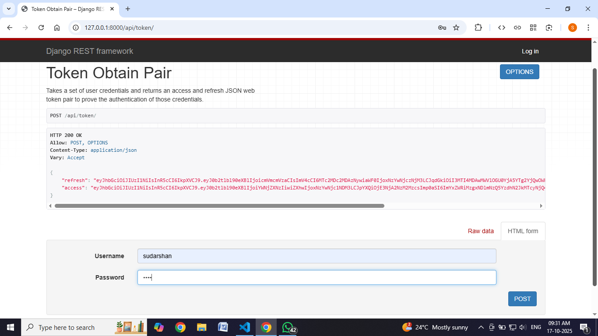
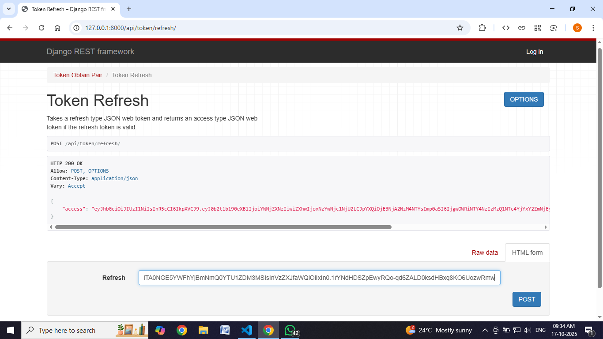
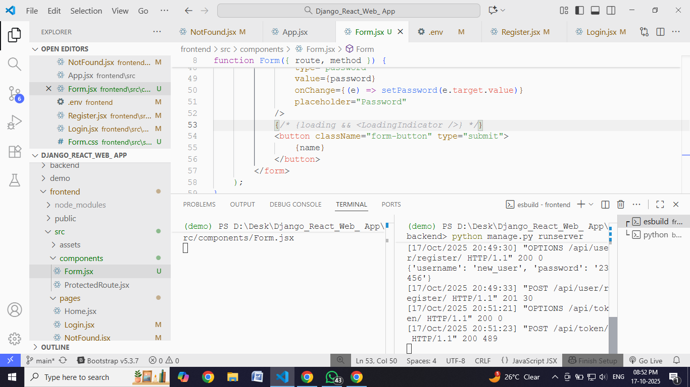
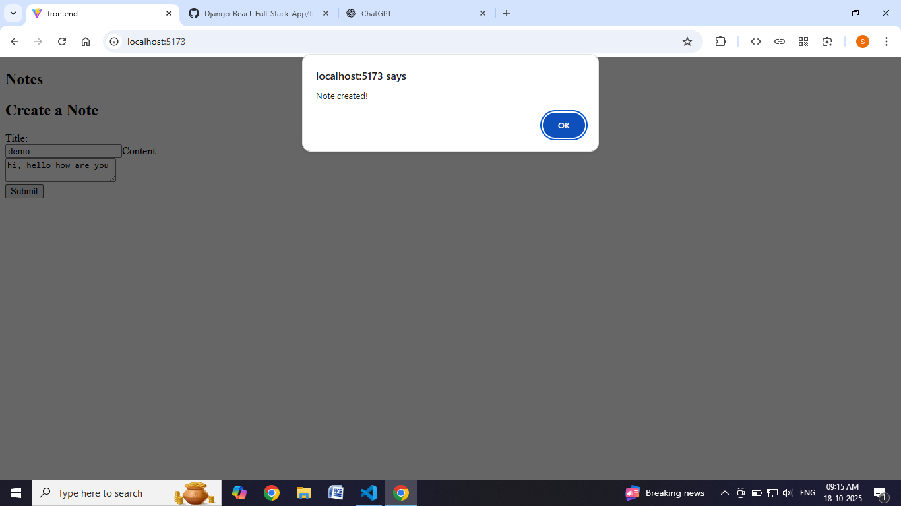
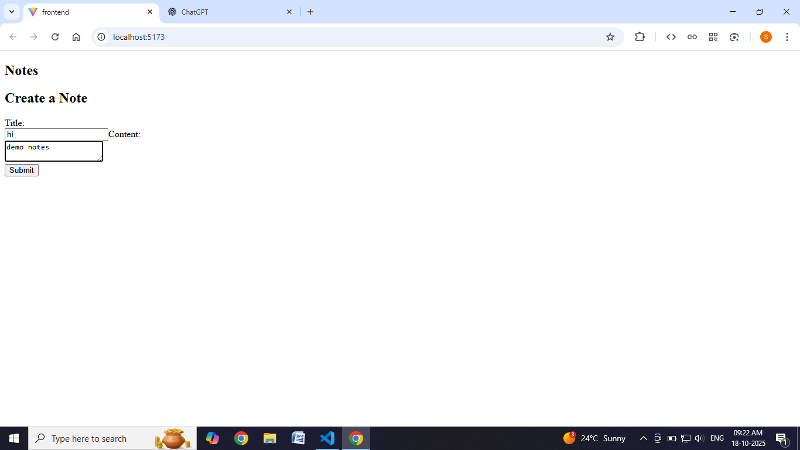

# Notes-Creator

**Full-stack notes app — Django (DRF) backend + React frontend.**  
Lightweight, secure CRUD with JWT auth, Docker support, and simple deployment instructions.

---

## Tech stack
- Backend: Python, Django, Django REST Framework
- Frontend: React, Vite, Tailwind CSS
- Auth: JWT (djangorestframework-simplejwt)
- DB: PostgreSQL (development: SQLite supported)
- Dev: Docker, GitHub Actions

---

## Features
- Email/password signup and JWT login
- Create / Read / Update / Delete notes
- Private user notebooks (notes scoped to user)
- Search and basic tagging
- Example dataset for quick demo

---

## Repo layout

```
/backend              # Django project (API)
  ├─ app/             # core apps (notes, users)
  ├─ requirements.txt
/frontend             # React app (Vite)
  ├─ src/
  ├─ package.json
/docs                 # screenshots, demo GIFs
/docker-compose.yml
```


---

## Quickstart — local (Linux / macOS)
### Backend
```bash
cd backend
python -m venv venv
source venv/bin/activate
pip install -r requirements.txt
cp .env.example .env
python manage.py migrate
python manage.py createsuperuser
python manage.py runserver
```

### Frontend
```bash
cd frontend
npm install
npm run dev
# open http://localhost:5173
```

Windows note: use `venv\Scripts\activate` to activate the virtualenv.

---

## Quickstart — Docker
```bash
docker-compose up --build
# Backend: http://localhost:8000
# Frontend: http://localhost:3000
```

---

## Environment variables (.env example)
```ini
DJANGO_SECRET_KEY=your_secret_key
DATABASE_URL=postgres://user:pass@db:5432/notes_db
DEBUG=True
FRONTEND_URL=http://localhost:3000
```

---

## API endpoints (examples)
- POST `/api/auth/register/`
- POST `/api/auth/token/`
- GET `/api/notes/`
- POST `/api/notes/`

---

## Tests
```bash
cd backend
pytest -q
```

## Screenshots / Demo

<figure>
  
  <figcaption>Registration endpoint rejecting GET with 405 Method Not Allowed.</figcaption>
</figure>

<figure>
  
  <figcaption>POST /api/user/register/ returned 201 Created with user details.</figcaption>
</figure>

<figure>
  
  <figcaption>Valid login returning access and refresh JWT tokens.</figcaption>
</figure>

<figure>
  
  <figcaption>Refresh token endpoint generating a new access token.</figcaption>
</figure>

<figure>
  
  <figcaption>React form component sending POST requests to the backend.</figcaption>
</figure>

<figure>
  
  <figcaption>Frontend note creation form with title and content fields.</figcaption>
</figure>

<figure>
  
  <figcaption>Filled form demonstrating user interaction before submission.</figcaption>
</figure>

<figure>
  
  <figcaption>Success alert confirming the note was created.</figcaption>
</figure>

<figure>
  
  <figcaption>Notes list displaying saved notes with delete buttons.</figcaption>
</figure>


## Contributing
Fork → branch feature/<name> → PR.

Follow PEP8; run black ..

Add tests for new features.

## License
MIT — see LICENSE file.

## Contact
Sudarshan Reddy — sudarshan382003@gmail.com
Resume: /mnt/data/Sudarshan_Reddy_Medapati_Resume.pdf
